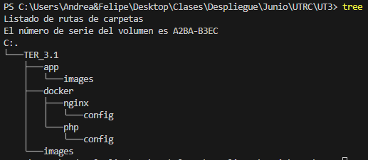
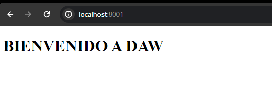
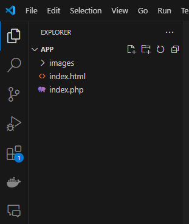
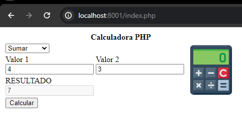
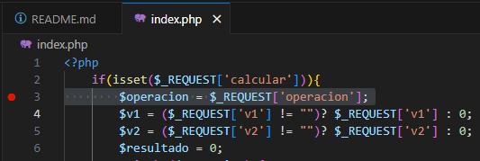

# TER 3.1: Implantación página web PHP con Nginx + PHP-FPM, y depuración con XDebug
## Hecho por Felipe Aldehuela Flete

### Paso 1. Configuración

Vamos a preparar la estructura de la carpeta de trabajo creando las carpetas necesarias.


Después vamos a crear los archivos necesarios para poder trabajar con la práctica:

- Dentro de la carpeta **/TER3.1/** vamos a crear el archivo <strong>docker-compose-yml</strong> que es el encargado de tener la configuración para levantar los servicios.
- Dentro de **/TER3.1/docker/ngingx/config/** creamos el archivo <strong>default.conf</strong> que creará un puente entre las peticiones nginx y php-fpm.
- Dentro de **/TER3.1/docker/php/** creamos el archivo <strong>dockerfile</strong> que es quien va a crear la imagen del servicios de php.
- Dentro de **/TER3.1/docker/php/config/** vamos a crear los archivos <strong>error_reporting.ini y xdebug.ini</strong>. En estos archivos se van a guardar los logs de errores al depurar y la configurción para depurar con xdebug.
- Dentro de la carpeta **/TER3.1/app/** vamos a guardar todos los archivos necesarios y principales para la práctica.

### Paso 2. Dockerizacion de PHP-FPM

Vamos a crear una imagen para poder trabajar con <strong>PHP-FPM</strong>, con la imagen que crearemos vamos a instalar <strong>XDebug</strong> para activarlo, ya que gracias a ellos vamos a poder depurar nuestro código PHP.

Ahora vamos a configurar nuestros archivo dockerfile que tendrá el siguiente código:
```dockerfile
FROM php:8.3.0-fpm

# Install xdebug
# --> PECL is a repository for PHP Extensions and as PECL is not installed by default, we need to install it first
# --> xdebug is a PHP extension which provides debugging and profiling capabilities
# --> Activate el módulo xdebug, a través de la función docker-php-ext-enable
RUN pecl install xdebug-3.3.0 \
    && docker-php-ext-enable xdebug

EXPOSE 9000
```
Gracias a esto estaremos haciendo:

- Con FROM php:8.3.0-fpm vamos a partir con la imagen base para crear la nuestra.
- Con RUN pecl install xdebug-3.3.0 estamos instalando xdebug-3.3.0.
- Con docker-php-ext-enable xdebug estamos activando el xdebug.
- Con EXPOSE 9000 le estamos diciendo el puerto del ontenedor.

Vamos a comprobar que todo esto funciona con:
```docker
docker build -t Felipe/calculadora-php-nativa .
``` 

Vamos a borrar ahora la imagen para seguir con la práctica, la borraremos con:
```
docker rmi Felipe/calculadora-php-nativa
```

### Paso 3. Docker-Compose

Para preparar nuestro entorno vamos a crear el archivo <strong>docker-compose.yml</strong>, que es donde estaran los servicios y las configuraciones necesarias para trabajar.
El archivo llevará el siguiente código:
```yml
version: '1'
name: ter3_1-calculadora
services:
    web:
        image: nginx:1.25
        container_name: web
        ports:
        - 8001:80
        volumes:
        - ./app:/usr/share/nginx/html
        - ./docker/nginx/config/default.conf:/etc/nginx/conf.d/default.conf

    php-fpm:
        build: ./docker/php/
        volumes:
        - ./app:/usr/share/nginx/html
        - ./docker/php/config/xdebug.ini:/usr/local/etc/php/conf.d/docker-php-ext-xdebug.ini
        - ./docker/php/config/error_reporting.ini:/usr/local/etc/php/conf.d/error_reporting.ini
```
- version: Nombraremos la versión que usaremos en el proyecto.
- name: Le damos nombre al proyecto.
- services: Los diferentes servicios que vamos a usar y con los que vamos a trabajar.
- image: La imagen base con la que vamos a trabajar.
- container_name: El nombre que llavará el contenedor al ser creado.
- ports: Aquí declaramos los puertos que vamos a usar para enlazar el host con el contenedor.
- volumes: Declarar las carpetas con las que vamos a trabajar y donde vamos a enlazar dos directorios.
    - La carpeta de configuración <strong>default.conf</strong> es el archivo de configuración del servidor, y el que va a redirigir las peticiones al servidor. Tiene el siguiente código:

    ```conf
    server {
        listen       80;
        listen  [::]:80;
        server_name  localhost;
        
        root   /usr/share/nginx/html;

        access_log  /var/log/nginx/host.access.log  main;

        location / {
            #root   /usr/share/nginx/html;
            # root /var/www/html;
            index  index.html index.htm;
        }

        #error_page  404              /404.html;

        # redirect server error pages to the static page /50x.html
        #
        error_page   500 502 503 504  /50x.html;
        location = /50x.html {
            root   /usr/share/nginx/html;
        }

        location ~ \.php$ {
        # root /usr/share/nginx/html;
        fastcgi_pass php-fpm:9000;
        fastcgi_index  index.php;
        include fastcgi_params;  # fichero incluido en la instalación
        fastcgi_param SCRIPT_FILENAME $document_root$fastcgi_script_name;
        }
    }
    ```
    En el archivo <strong>docker-compose.yml</strong> enlazamos la ubicación del archivo en nuestro host con la del contenedor. Al modificar este archivo, los cambios se reflejan automáticamente al reiniciar el servicio, evitando la necesidad de modificar datos repetidamente en el contenedor.

- php-fpm: Basado en la imagen dockerizada antes.
- build: Para este servicio nos vamos a basar en el <strong>dockerfile</strong> que hemos creado antes.
- volumes: Aquí vamos a declarar las carpetas que vamos a enlazar del host con el contenedor.
    - Carpeta configuracion: Aquí está el archivo que nos ayudará a la configuración de <strong>XDebug</strong>. Tendrá el siguiente código:

    ```ini
    zend_extension=xdebug

    [xdebug]
    xdebug.mode=develop,debug
    xdebug.client_host=host.docker.internal
    xdebug.start_with_request=yes
    ```

    Con esto ponemos <strong>XDebug</strong> en modo desarrollo para que capture la depuración y con <strong>host.docker.internal</strong> se estblece que <strong>XDebug</strong> pueda conectarse a <strong>VS CODE</strong>

    - Carpeta de errores: Aquí está el archivo que recogerá todos los logs que se produzcan durante la depuración del archivo. Contendrá el siguiente código:

    ```ini
    error_reporting = E_ALL
    display_errors = On
    display_startup_errors = On
    log_errors = On
    ```

Ahora vamos a levantar el servicio poniendo el siguiente código:
```docker
docker compose up --build
```


Cuando el servicio está levantado vamos al navegador y ponemos <strong>localhost/8001</strong>

Como podemos comprobar funciona correctamente.

### Paso 3. La Aplicación Web

Vamos con la aplicación web y a crear una calculadora.

Nos vamos a la carpeta app del proyecto.



Tenemos que modificar el archivo <strong>index.php</strong> con el siguiente código:

```php
<?php
    if(isset($_REQUEST['calcular'])){
        $operacion = $_REQUEST['operacion'];
        $v1 = ($_REQUEST['v1'] != "")? $_REQUEST['v1'] : 0;
        $v2 = ($_REQUEST['v2'] != "")? $_REQUEST['v2'] : 0;
        $resultado = 0;
        switch ($operacion) {
            case 'sum':
                $resultado = $v1 + $v2;
            break;
            case 'res':
                $resultado = $v1 - $v2;
            break;
            case 'mul':
                $resultado = $v1 * $v2;
            break;
            case 'div':
                if($v2 != 0)
                    $resultado = $v1 / $v2;
                else
                    $resultado = 0;
            break;
            case 'exp':
                $resultado = $v1 ** $v2;
            break;

            default:
                # code...
                break;
        }
    }
?>
<form action="" method="post">
    <table>
        <tr>
            <th colspan="3">Calculadora PHP</th>
        </tr>
        <tr>
            <td colspan="2">
                <select name="operacion" id="">
                    <option value="sum">Sumar</option>
                    <option value="res">Restar</option>
                    <option value="mul">Multiplicar</option>
                    <option value="div">Dividir</option>
                    <option value="exp">Exponente</option>
                </select>
            </td>
            <td rowspan="3"></td>       
        </tr>
        <tr>
            <td>
                <label for="v1">Valor 1</label><br>
                <input type="number" name="v1" id="" value="<?php if (isset($v1)) echo $v1; ?>">
            </td>
            <td>
                <label for="v2">Valor 2</label><br>
                <input type="number" name="v2" id="" value="<?php if (isset($v2)) echo $v2; ?>">
            </td>
        </tr>
        <tr>
            <td colspan="2">
                <label for="res">RESULTADO</label><br>
                <input type="number" name="res" disabled value="<?php if (isset($resultado)) echo $resultado; ?>">
            </td>
        </tr>
        <tr><td colspan="3"><button type="submit" name="calcular">Calcular</button></td></tr>
    </table>
</form>

```

Enviamos información a través de un formulario y la capturamos al refrescar la página. Dependiendo de la opción elegida, se realiza la operación correspondiente. En la parte HTML, si existen variables, se asignan a la opción value para mostrarlas por defecto en la página.

Vamos a añadir código css también:

```css
tr, th, td {
    padding: 15px;
}
table{
    margin: 50px auto;
    border-collapse: collapse;
    text-align: center;
    border: 5px solid black;
    box-shadow: 0 0 15px black;
}
table input{
    width: 50%;
    box-shadow: 1px 1px 5px;
    text-align: center;
    padding: 3px;
}
table select{
    width: 100%;
    box-shadow: 1px 1px 5px;
    text-align: center;
    padding: 3px;
}
table th{
    background-color: #EB984E;
    font-size: 1.5rem;
    font-weight: bolder;
}
table td{
    background-color: #AED6F1;
}
table button{
    background-color: #D7DBDD;
    padding: 10px;
    border-radius: 10px;
    box-shadow: 3px 3px 10px black;
}
```

Ya tenemos nuestro servicio activo y bien codificado, ahora vamos a ponerlo en marcha con:
> http://localhost:8001/index.php




### Paso 4. Depuración.

En VS Code, abrimos la carpeta "app" para depurar. Para configurar la depuración, seleccionamos "Crear archivo launch.json" en la sección de depuración del árbol de funciones.


Este paso nos ha creado una carpeta <strong>.vscode</strong> en nuestro explorador de carpetas, y dentro un archivo json. Que lo tenemos que modificar con el siguiente código:

```json
{
    "version": "0.2.0",
    "configurations": [
        {
            "name": "PHP-Debug",
            "type": "php",
            "request": "launch",
            "port": 9003,
            "pathMappings": {
                "/usr/share/nginx/html": "${workspaceFolder}/app"
            }
        }
    ]
}
```
> Ojo a la parte *"${workspaceFolder}"* aqui debemos poner la ruta relativa con respecto donde está *index.php*.

Ya que esto va a mapear la carpeta de trabajo de nuestro contenedor para poder depurar.

Ponemos el punto de interrupción justo cuando capturamos las variables que vamos a calcular.


En la pestaña de depuración de VS Code, ejecutamos en modo depuración. Cuando la aplicación web llega al punto de interrupción, se detiene. Luego, ingresamos valores en ambos campos y hacemos clic en "Calcular". Al refrescarse, se detendrá en el punto de interrupción y podemos avanzar paso a paso (F10) para observar el comportamiento del programa línea por línea, viendo los valores de las variables en la parte izquierda.


Y con esto ya hemos terminado todo.